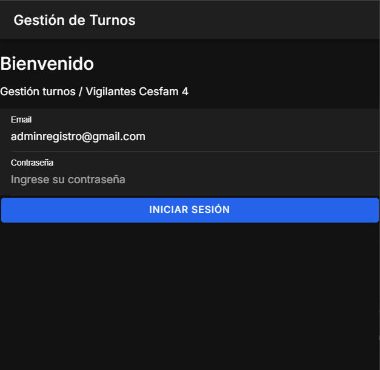
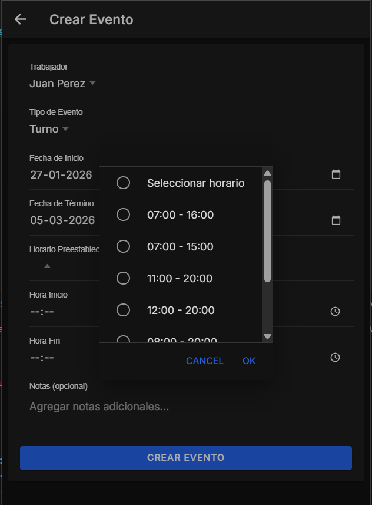
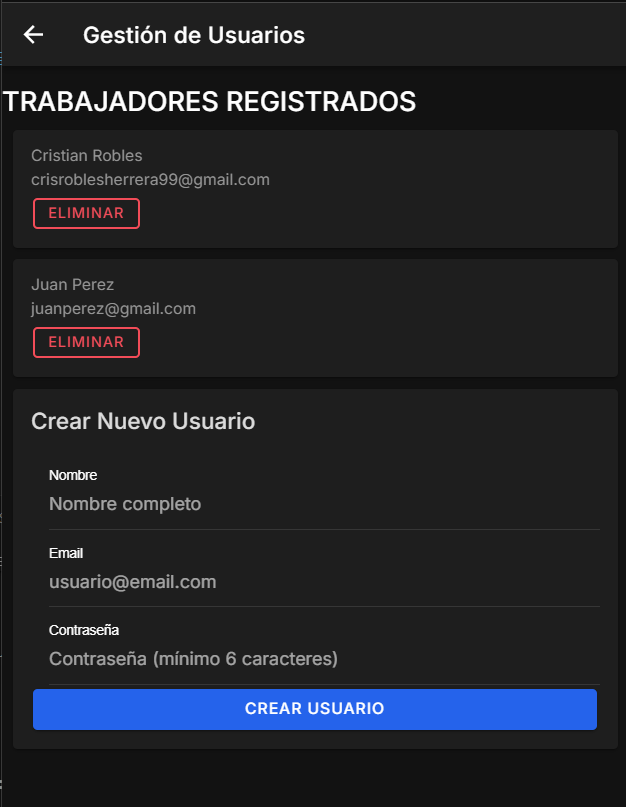
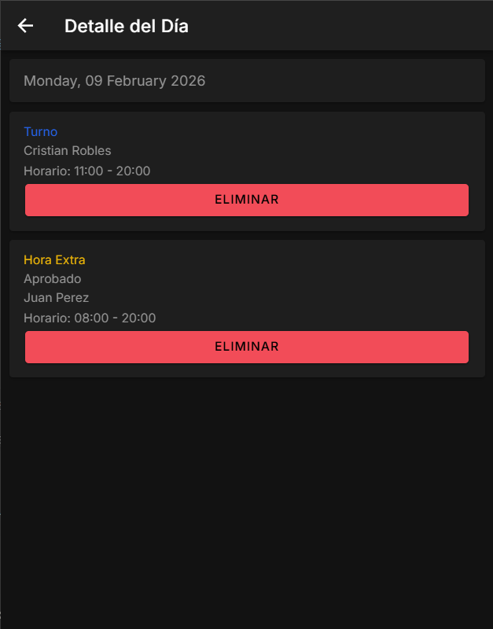

# 📅 turnosVig – Sistema de Gestión de Turnos (Ionic + Angular + Firebase)

**turnosVig** es una **aplicación web/mobile** desarrollada con **Ionic y Angular**, orientada a la **gestión de turnos laborales**, usuarios y eventos, con persistencia en la nube mediante **Firebase**.

El sistema está pensado para organizaciones como **CESFAM, empresas de seguridad o instituciones**, donde se requiere un control claro de turnos, horas extra y permisos desde una interfaz moderna y mobile first.

---

## 🌐 Repositorio del proyecto

🔗 https://github.com/CrisDev-ch/turnosVig

---

## 🎯 Objetivo del proyecto

El objetivo principal de **turnosVig** es:

- Gestionar turnos laborales de trabajadores
- Registrar horas extra y permisos
- Visualizar turnos en formato calendario
- Administrar usuarios desde un panel central
- Mantener información sincronizada en tiempo real
- Ofrecer una experiencia fluida en dispositivos móviles

El proyecto simula un **sistema de control de turnos real**, ideal como solución interna o proyecto de portafolio avanzado.

---

## 📱 Enfoque Mobile First

Al estar construido con **Ionic**, el sistema está diseñado bajo un enfoque **Mobile First**, lo que permite:

- Uso óptimo en celulares 📲
- Componentes nativos (inputs, modales, calendarios)
- Interfaz táctil intuitiva
- Adaptación automática a desktop y tablet

---

## 🔐 Autenticación y acceso

El sistema cuenta con **inicio de sesión**, permitiendo:

- Acceso seguro al sistema
- Identificación del usuario activo
- Separación entre vista pública y panel administrativo

  

---

## 🧭 Dashboard y Calendario de Turnos

El **dashboard principal** presenta un **calendario interactivo**, desde donde se puede:

- Navegar entre meses
- Visualizar turnos asignados
- Identificar tipos de eventos mediante colores
- Acceder al detalle diario de turnos

  

### 📌 Leyenda de eventos
- 🔵 Turno aprobado
- 🟡 Hora extra aprobada
- 🔴 Permiso aprobado

---

## ➕ Creación y gestión de eventos

Desde el panel se pueden **crear eventos** asociados a un trabajador:

- Selección de trabajador
- Tipo de evento (turno, hora extra, permiso)
- Rango de fechas
- Horarios preestablecidos
- Notas opcionales

  

---

## 👥 Gestión de Usuarios

El sistema incluye un **módulo de administración de usuarios**, donde se puede:

- Visualizar trabajadores registrados
- Eliminar usuarios
- Crear nuevos trabajadores
- Asociar usuarios al sistema de turnos

  

---

## 📋 Detalle diario de turnos

Cada día permite visualizar el **detalle completo de eventos registrados**, con opción de eliminación:

  

---

## ☁️ Backend con Firebase

El proyecto utiliza **Firebase** como backend, específicamente:

- **Firebase Authentication**
  - Gestión de usuarios
  - Inicio de sesión seguro

- **Cloud Firestore**
  - Almacenamiento de turnos
  - Eventos (turnos, horas extra, permisos)
  - Usuarios
  - Fechas y horarios
  - Sincronización en tiempo real

Esto permite:
- Persistencia en la nube
- Acceso desde cualquier dispositivo
- Simulación de un sistema productivo real

---

## 🛠️ Tecnologías utilizadas

- **Angular** → framework principal
- **Ionic** → componentes UI mobile
- **TypeScript** → tipado y estructura
- **Firebase Authentication** → login y usuarios
- **Firebase Firestore** → base de datos en la nube
- **HTML / CSS** → estructura y estilos

---

## 🗂️ Estructura del proyecto

